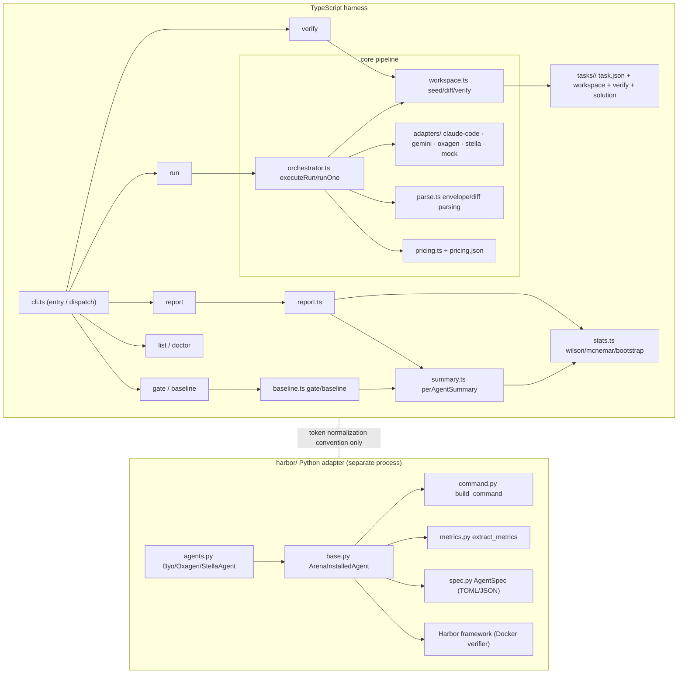

# Arena architecture

Two subsystems share one repo: a TypeScript CLI harness (`src/`) and a Python Harbor adapter (`harbor/`). They share no code, only a token-normalization convention: `input` never includes cache reads.

## One trial, end to end

1. `cli.ts:cmdRun` parses argv into a `RunConfig`, loads tasks.
2. `orchestrator.ts:executeRun` creates the run dir, checks each adapter's availability, writes `manifest.json`, then loops trials × tasks × agents with ABBA order flipping.
3. `runOne`: `seedWorkspace` copies the fixture into a temp dir and git-commits the seed → `adapter.execute` spawns the CLI (own process group, SIGKILL tree on timeout) → `collectDiff` captures exactly what the agent changed → `parseEnvelope` normalizes tokens → held-out `runVerification` (wipe `.arena-verify/`, copy tests in, `node --test`, wipe again) → `TrialResult` written; `results.json` rewritten every trial.
4. `report.ts` renders per-agent summaries (via `summary.ts`, the same aggregation the gate uses), pairwise McNemar and bootstrap deltas, the per-task matrix, and receipts.
5. `baseline.ts` snapshots a run (`baseline save`) and gates later runs (`gate`), refusing task-set mismatches and, with `--require-significant`, only failing accuracy drops that clear the 95% CIs.

## Contracts

- **Adapter** (`src/adapters/base.ts`): implement `name`, `defaultBinary`, `buildArgs(args)` (argv array, never shell), and `parseEnvelope(stdout)` returning normalized tokens (`input` excludes cache reads; use `totalize`/`emptyEnvelope`). Optional overrides: `resolveModel`, `env`, `execute`, `isAvailable`/`version`. Register in `src/adapters/index.ts`.
- **Task fixture** (`tasks/<id>/`): `task.json` (`id` must equal the dir name), `workspace/` (what the agent sees), `verify/` (held-out `node:test` suite, never on disk during the run), `solution/` (reference proving solvability). `arena verify` enforces: pristine fails, solution passes.
- **Harbor spec** (`harbor/arena_harbor/spec.py`): a TOML/JSON file with `name`, `binary`, `run_template` (`{bin} {model} {budget} {timeout} {instruction}` placeholders; instruction shell-quoted for you), plus install and metrics blocks. Point `ARENA_AGENT_SPEC` at it; no Python needed.
